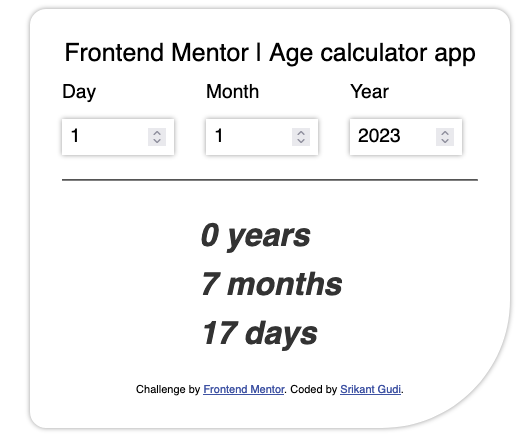

# Frontend Mentor - Age calculator app solution

This is a solution to the [Age calculator app challenge on Frontend Mentor](https://www.frontendmentor.io/challenges/age-calculator-app-dF9DFFpj-Q). 

## Table of contents

- [Overview](#overview)
  - [The challenge](#the-challenge)
  - [Screenshot](#screenshot)
  - [Links](#links)
- [My process](#my-process)
  - [Built with](#built-with)
  - [What I learned](#what-i-learned)
  - [Continued development](#continued-development)
  - [Useful resources](#useful-resources)
- [Author](#author)
- [Acknowledgments](#acknowledgments)

**Note: Delete this note and update the table of contents based on what sections you keep.**

## Overview

### The challenge

Users should be able to:

- View an age in years, months, and days after submitting a valid date through the form
```
- The age is calculated using the `reactive` feature of Svelte. Hence, the difference is immediately visible.
- Input type = `number` is used by setting the `min` and `max` values.
- Max value of year is calulated initially.
```

### Screenshot



### Links

- Solution URL: [https://github.com/srikantgudi/age-calculator](https://github.com/srikantgudi/age-calculator)
- Live Site URL: [https://age-calculator-srikantgudi.vercel.app/](https://age-calculator-srikantgudi.vercel.app/)

## My process

### Built with

- SvelteKit

### What I learned

To code challeng apps.

### Continued development


### Useful resources

- [https://kit.svelte.dev/](https://kit.svelte.dev/) - This helped me for creating sveltekit apps.

## Author

- Website - [Srikant Gudi](https://github.com/srikantgudi)
- Frontend Mentor - [@srikantgudi](https://www.frontendmentor.io/profile/srikantgudi)
